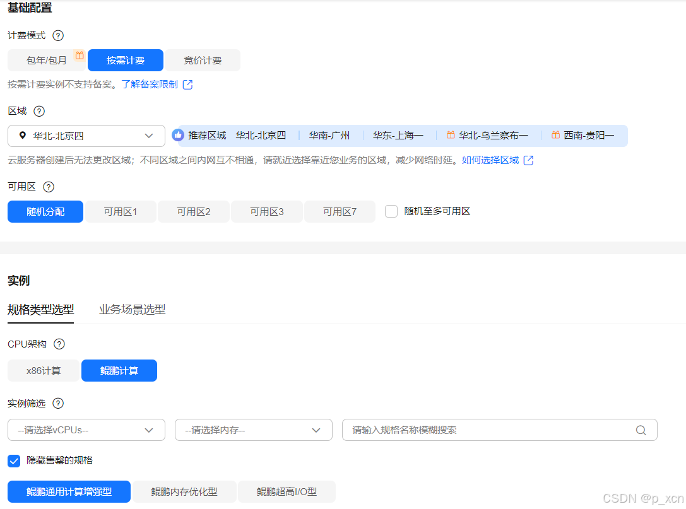
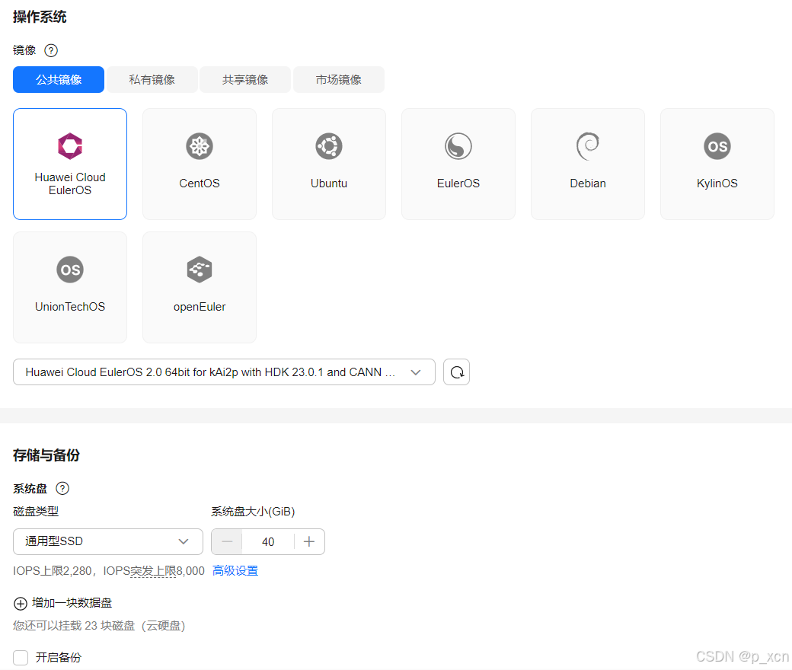
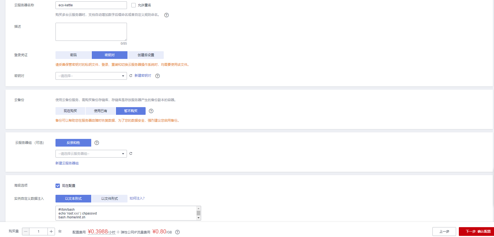
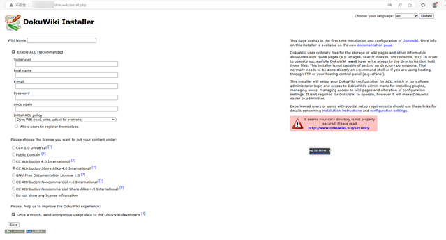

# DokuWiki 引擎应用使用指南

# 商品链接

 [DokuWiki引擎应用](https://marketplace.huaweicloud.com/hidden/contents/7e0e8012-ace6-4411-bece-1615d5d9216b#productid=OFFI1132211660972929024)

# 商品说明

DokuWiki 是一个简单易用、用途多样并且不依赖数据库的开源维基软件。它因简洁易读的语法受到用户的喜爱。而容易维护、备份方便和易于整合则使它成为管理员的最爱。内置的访问控制和认证管理使 DokuWiki 在企业环境下特别适合，而由充满活力的社区贡献的众多插件对其功能的扩充则令它拥有了比传统维基更广阔的应用。

本商品通过鲲鹏服务器+EulerOS2.0进行安装部署。

# 商品购买

您可以在云商店搜索 **DokuWiki引擎应用**。

其中，地域、规格、推荐配置使用默认，购买方式根据您的需求选择按需/按月/按年，短期使用推荐按需，长期使用推荐按月/按年，确认配置后点击“立即购买”。

## 商品支持自定义 ECS 购买，具体见 [ECS 控制台配置](#ECS控制台配置)

## 使用 RFS 模板直接部署

1. 选择 **模板配置开通**，点击 **下一步**。

2. 必填项填写后，点击 **下一步**。

3. 创建直接计划后，点击 **确定**。

4. 点击 **部署**。

5. 如下图出现 `Apply required resource success` 即为资源创建完成。

# 商品资源配置

商品支持 **ECS 控制台配置**，下面对资源配置的方式进行介绍。

## ECS 控制台配置

### 准备工作

在使用ECS控制台配置前，需要您提前配置好 **安全组规则**。

> **安全组规则的配置如下：**
> - 入方向规则放通端口 `80`，**源地址内必须包含您的客户端 ip**，否则无法访问
> - 入方向规则放通 CloudShell 连接实例使用的端口 `22`，以便在控制台登录调试
> - 出方向规则一键放通

### 创建ECS

前提工作准备好后，选择 ECS 控制台配置跳转到购买 ECS 页面，ECS 资源的配置如下图所示：

> **值得注意的是：**
> - VPC 您可以自行创建
> - 安全组选择 [**准备工作**](#准备工作) 中配置的安全组；
> - 弹性公网IP选择现在购买，推荐选择“按流量计费”，带宽大小可设置为5Mbit/s；
> - 高级配置需要在高级选项支持注入自定义数据，所以登录凭证不能选择“密码”，选择创建后设置；
> - 其余默认或按规则填写即可。

# 商品使用

## Dokuwiki使用

### 访问Dokuwiki

http://$ip/dokuwiki/install.php

按照要求填写信息，点击“save”，即可使用dokuwiki。
